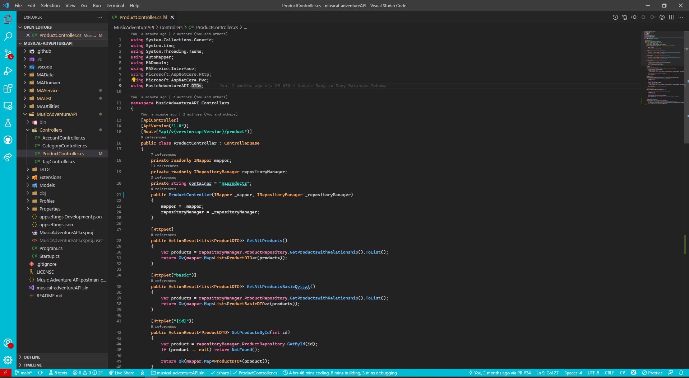

# Salty Sea

A blend between the default theme and a touch of blue and red

## Install

press `ctl/command + shift + p` to launch the command palette then run

```
ext install salty-sea
```

## Screenshot

Screenshot of Ruby and JavaScript



If you like this theme checkout [One Dark Theme](https://marketplace.visualstudio.com/items?itemName=azemoh.theme-onedark)

## Change log

You can take a look at the change log [here](https://github.com/Darkace01/salt-ace/blob/main/CHANGELOG.md)
